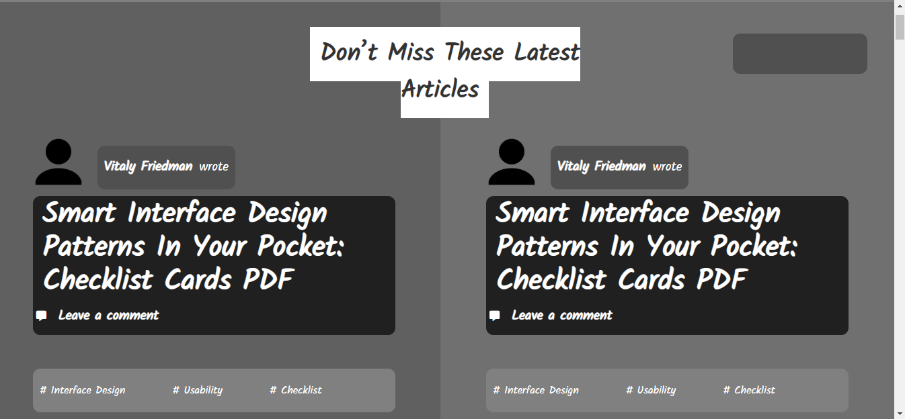

# Smashing-Magazine

The project consist in create a grayscale heat map of the website Amashin Magazine that indicates which elements have the greatest weight in the visual hierarchy..

## Built With

- [HTML](https://developer.mozilla.org/en-US/docs/Web/HTML),
- [CSS](https://www.w3schools.com/css/),
- [Fontawesome](https://fontawesome.com/),
-[googlefonts](https://www.google.com/),

## Live Demo

[Live Demo Link](https://rawcdn.githack.com/BrianSammit/Smashing-Magazine/a4f4fbebc6d61f343f92dd3fe9fd13a018267c77/index.html)

## Authors

👤 Brian Sammit Cruz Rodriguez

Github: @BrianSammit https://github.com/BrianSammit

Twitter: @CruzSammit https://twitter.com/CruzSammit

Linkedin: https://www.linkedin.com/in/brian-sammit-cruz-rodriguez-5877551a8/

👤 Ssegawa Alvin Louis K

Github: https://github.com/ositaadimma

Twitter:@alvinlouis29 https://github.com/alvinlouis29

## 🤝 Contributing

Contributions, issues and feature requests are welcome!

## Show your support

Give a ⭐️ if you like this project!

## Acknowledgments

- Microverse
- W3schools
- Freecodecamp
- Developer.mozilla
- Learnshayhowe
- Odin project

## 📝 License

NO licese: This project is free for anyone to use.
